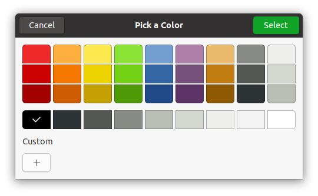
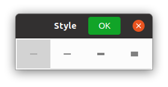

# Using Paint

<style>
thead tr th:first-child, tbody tr td:first-child {
  min-width: 30%;
}
</style>

## Starting "Paint"

The program filename is "esrille-paint".

Select "Paint" from the graphics application list.
A "Paint" window like below will open:


When you move the mouse cursor to the drawing canvas, the mouse cursor becomes a pencil.
You can draw a curved line as you drag in the canvas.
You can choose a color with the [Color] button.
You can choose a tool with the [Tool] button.
We will describe each tool in the next sections.


To run "Paint" from the command line, type as follow:

```
$ esrille-paint [filename]...
```

In the filename part, type the name of the file you want to open.
When creating a new file, you do not have to specify the filename.

## Colors

You can choose a color with the [Color] button.
A "Pick a Color" dialog like below will open:



Click any color to make it the current color, and click [Select] to change the color.
To create your own custom color, click [+] button in the [Pick a Color] dialog.

## Tools

You can choose a tool with the [Tool] button.
A "Tool" dialog like below will open:


Click any tool to make it the current tool.

Frequently used tools can be selected using keyboard;
you can choose a tool simply typing the key listed in the first column in the table below:

Tool | Description
---|---
 Lasso | Create a non-rectangular selection to move, stretch or shrink.<br>Drag in the canvas to select a non-rectangular area. Then position the mouse cursor inside the area surrounded by a dotted outline and drag.<br>• Use the [Shift] key to constrain the movement and/or to maintain the proportion of your selection.<br>• Use the [Escape] key to complete the current selection.
 Select<br><b>[S]</b> | Create a rectangular selection to move, stretch or shrink. Drag in the canvas to select a rectangular area. Then position the mouse cursor inside the area surrounded by a dotted outline and drag.<br>• Use the [Shift] key to constrain the movement and/or to maintain the proportion of your selection.<br>• Use the [Escape] key to complete the current selection.<br>• Use <b>[Ctrl]+[A]</b> to select the entire drawing canvas.
 Pencil<br><b>[P]</b> | Draw a curved line where you drag.
 Eraser<br><b>[E]</b> | Erase where you drag.
 Line | Draw a straight line as you drag. The drawing is completed when you finish dragging.<br>• Use the [Shift] key to constrain drawing.
 Rectangle | Draw a rectangle as you drag. The drawing is completed when you finish dragging.<br>• Use the [Shift] key to draw squares.
 Oval | Draw an oval as you drag. The drawing is completed when you finish dragging.<br>• Use the [Shift] key to draw circles.
 Text<br><b>[T]</b> | Type text.<br>Click where you want to add text. Then type your text.<br>You can move, stretch or shrink the text; position the mouse cursor around the text and drag.<br>• Use the [Shift] key to constrain the movement and/or to maintain the proportion of the text.<br>• Use the [Escape] key to finish typing.

## Style

You can choose a line width with the [Style] button.
A "Style" dialog like below will open:



Click any style to make it the current line width.

Style | Description
---|---
 &nbsp;&nbsp;&nbsp;&nbsp; | 1 px
 | 2 px
 | 4 px
 | 8 px

## Editing

You can use edit buttons to perform image editing tasks, such as Cut and Paste.

Button | Description
---|---
Undo<br><b>[Ctrl]+[Z]</b> | Undo the last action.
Redo<br><b>[Ctrl]+[Shift]+[Z]</b> | Redo the last action you undid.
Cut<br><b>[Ctrl]+[X]</b> | Remove the selection to the Clipboard.
Copy<br><b>[Ctrl]+[C]</b> | Copy the selection to  the Clipboard.
Paste<br><b>[Ctrl]+[V]</b> | Paste the image or text from the Clipboard. You can move, stretch or shrink the pasted content where you drag.<br>• Use the [Shift] key to constrain the movement and/or to maintain the proportion of the pasted image or text.

## Saving

Your changes to the image will be lost if you don't save them to a file.
To save changes, click the [Save] button in the header bar of the "Paint" window.
Enter a filename the first time you save a new image, then click the [Save] button in the dialog box.

You can also use <b>[Ctrl]+[S]</b> to save the image.

## Primary menu

You can open the primary menu with the [Primary menu] button in the header bar.
The primary menu contains the following menu items.

Menu item | Description
---|---
New...<br><b>[Ctrl]+[N]</b> | Enter the width and height of the new image, then click [OK] to open a new Paint window.
Open...<br><b>[Ctrl]+[O]</b> | Select the image file to open, then click [Open] to open a new Paint window.
Save<br><b>[Ctrl]+[S]</b> | Save changes.<br>Enter a filename the first time you save a new image, then click the [Save] button in the dialog box.
Save As... | Save a copy of the image.<br>Enter a filename for the copy, then click the [Save] button in the dialog box.
Font... | Change the font and font size used with the Text tool.
Transparent Mode | If enabled, selection tools do not select pixels of the background color.
Background Color | Choose the background color.
Help | Open the Paint's user guide in the default web browser.
About Paint | Open a dialog box that displays the Paint's version number and other information.

### Note

The file format supported in the Paint version 0.1.0 is only PNG. The other file formats will be supported in the future versions.
